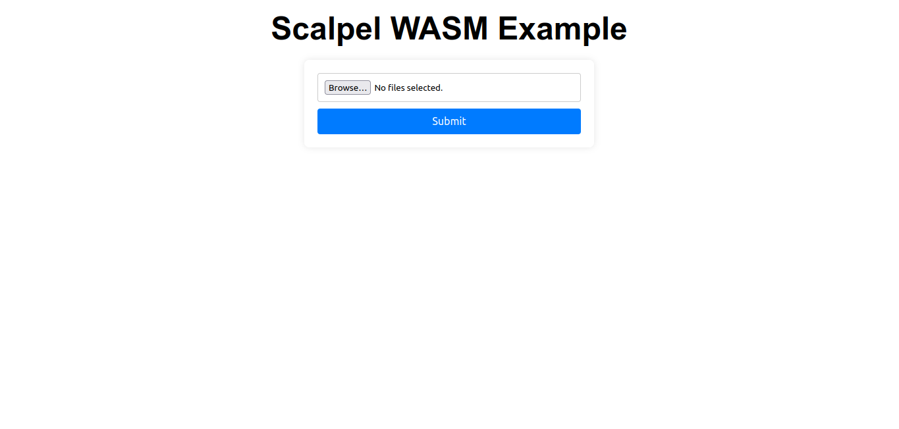
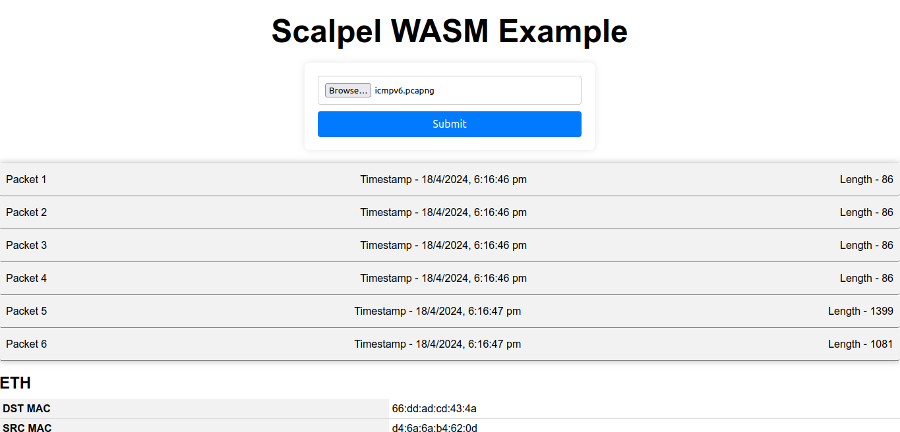
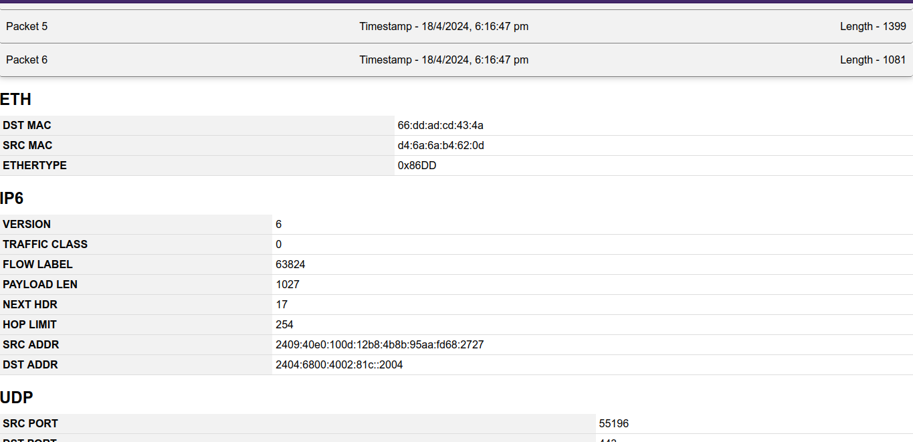

# Scalpel WASM Example

This example project demonstrates that [scalpel](https://github.com/ystero-dev/scalpel) can be used to dissect packets in the browser. This is a simple `actix` server which exposes one endpoint `/save_files` that returns hex encoded string of data. This data is then dissected in the browser.

## Images

